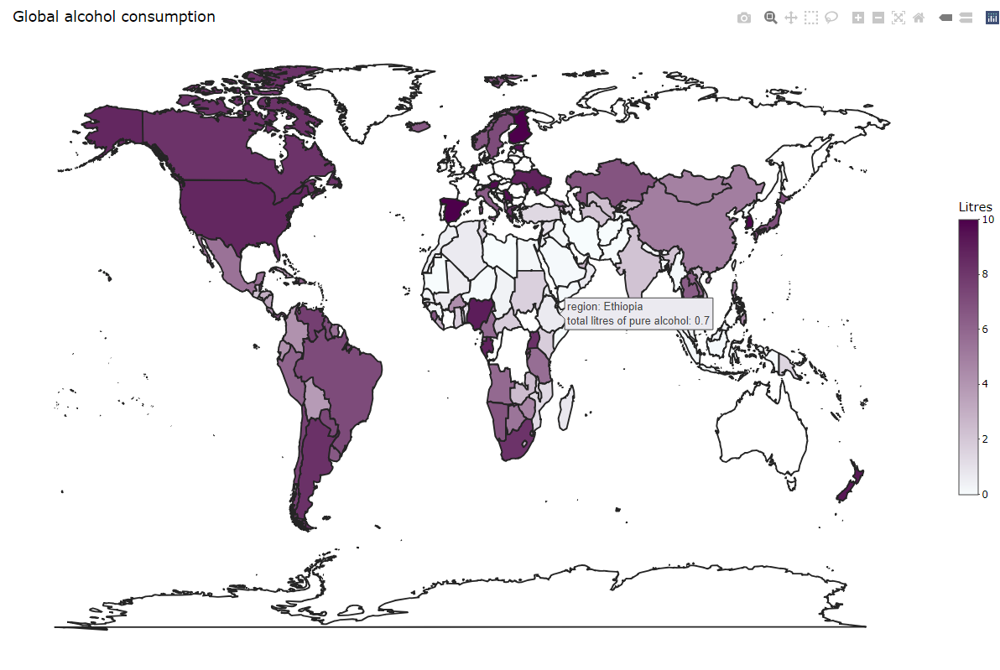

<!-- README.md is generated from README.Rmd. Please edit that file -->

```{r, include = FALSE}
knitr::opts_chunk$set(
  collapse = TRUE,
  comment = "#>",
  fig.path = "man/figures/README-",
  out.width = "100%"
)
```

# asdata

<!-- badges: start -->
<!-- badges: end -->

The goal of asdata is to give a good overview of national alcohol consumption and servings of beer, spirit and wine,  and make it easy to compare alcohol consumption and servings from country to country.

## Installation

You can install the development version of asdata from [GitHub](https://github.com/) with:

``` r
# install.packages("devtools")
devtools::install_github("etc5523-2022/rpkg-DI-CUI")
```

## Example


```{r example}
library(asdata)
```

### Plotting alcohol comsumption and servings

The below examples use the built-in dataset `alcohol_map`, you could produce plot about global alcohol consumption and servings. There are two functions: `plotly_litres()` function and `plot_servings()` function.

`plotly_litres()` function could plot global alcohol consumption map in a total litres of pure alcohol range, and convert the plot to plotly object automatically.  You could use this function to perform the alcohol consumption distribution.

In this example, mapping global alcohol consumption with total litres of pure alcohol in the range (0,10), you could see that except for northern Europe and Australia, the total litres of pure alcohol of most countries are less than 10.

```r
# Not run
consumption <- plotly_litres(Litres = c(0,10))
consumption
```
```{r echo=FALSE}

```
_Image: screenshot of consumption_

<br>

`plot_servings()` function maps global alcohol servings of beer, spirit and wine.

In this example, mapping global beer servings. There are high beer servings in Europe.

```{r warning=FALSE}
beer_servings <- plot_servings(type = "beer_servings")
beer_servings
```


### Specific numerical differences of alcohol consumption and servings by country

The below examples use the built-in dataset `alcohol`, you could see specific numerical differences about alcohol consumption and servings by using `extract_country_servings()` function and `calculate_country_alcohol()` function.

`extract_country_servings()` function is used to obtain a list of countries in this alcohol servings range in descending order of this alcohol servings.

In this example, prodcing a data.frame contains country with beer servings in range (0,100), and showing the top 6 rows.

```{r}
country_servings <- extract_country_servings(range = c(0,100), type = "beer_servings")
head(country_servings)
```


`calculate_country_alcohol()` function calculates the average alcohol consumption and servings of selected countries, as well as the difference between the alcohol consumption and servings of each country and the average.

In this example, combine with `extract_country_servings()` function to calculate the average beer servings of countries with beer servings in the range (0,100) and produce a data.frame to see the difference between beer_servings of each country with the average.
```{r}
cal_beer <- calculate_country_alcohol(name = country_servings$country, type = "beer_servings")
```

You could use `cal_beer[[1]]` to see the mean value.
```{r}
cal_beer[[1]]
```

You could use `cal_beer[[2]]` to see the data.frame, showing the top 6 rows of the data.frame
```{r}
head(cal_beer[[2]])
```


In this example, input a vector of country names to calculate the average wine servings of China, Japan, France, Australia and the USA, and to produce a data.frame to see the difference between wine servings in China, Japan, France, Australia and the USA with the average.
```{r}
country <- c("China","Japan","France", "Australia","USA")
cal_wine <- calculate_country_alcohol(name = country, type = "wine_servings")
```

You could use `cal_wine[[1]]` to see the mean value.
```{r}
cal_wine[[1]]
```


You could use `cal_wine[[2]]` to see the data.frame.
```{r}
cal_wine[[2]]
```


